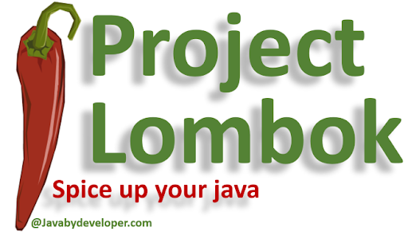

# 메이븐 vs 그레이들

스프링 부트 프로젝트는 빌드 도구인 아파치 메이븐이나 그레이들을 사용해서 구성할 수 있다. (요즘에는 그레이들 많이 쓴다고 한다.)

# 자바 vs 코틀린

스프링 부트 프로젝트에는 자바와 코틀린 모두 사용 가능

# 데이터베이스 지원

스프링 부트는 다양한 SQL 및 noSQL 데이터베이스를 지원한다.

# 롬복

롬복은 여러 가지 애너테이션을 사용해서 POJO객체의 생성자, 게터, 세터, toString 등을 자동으로 만들어준다.
-> 즉 반복 메서드 작성 코드를 줄여주는 라이브러리

> POJO(Plain Old Java Object)란?
> Java로 생성하는 순수한 객체

> 📢 추가 Lombok 정리

- @Getter
  - 해당 클래스의 필드에 대한 getter 메서드를 자동으로 생성합니다.
  - 필드에 대한 값을 가져올 때 사용되는 메서드를 자동으로 생성하여 코드를 간결하게 만듭니다.
- @Setter
  - 해당 클래스의 필드에 대한 setter 메서드를 자동으로 생성합니다.
  - 필드에 값을 설정할 때 사용되는 메서드를 자동으로 생성하여 코드를 간결하게 만듭니다.
- @Builder
  - 빌더 패턴을 자동으로 생성합니다.
  - Builder 패턴은 객체를 생성하는 데 사용되며, 객체 생성 시 매개변수를 지정할 수 있습니다.
- @AllArgsConstructor
  - 모든 필드를 인자로 받는 생성자를 자동으로 생성합니다.
  - 모든 필드를 초기화하는 생성자를 자동으로 생성하여 객체를 생성할 때 모든 필드에 대한 값을 지정할 수 있도록 합니다.
- @NoArgsConstructor
  - 매개변수가 없는 기본 생성자를 자동으로 생성합니다.
  - 매개변수 없이 객체를 생성할 때 사용됩니다.
- @RequiredArgsConstructor
  - final 변수, Notnull 표시가 된 변수처럼 필수적인 정보를 세팅하는 생성자를 생성합니다.
  - 해당 필드를 매개변수로 받는 생성자를 자동으로 생성하여, 해당 필드를 초기화하지 않고는 객체를 생성할 수 없도록 합니다.
