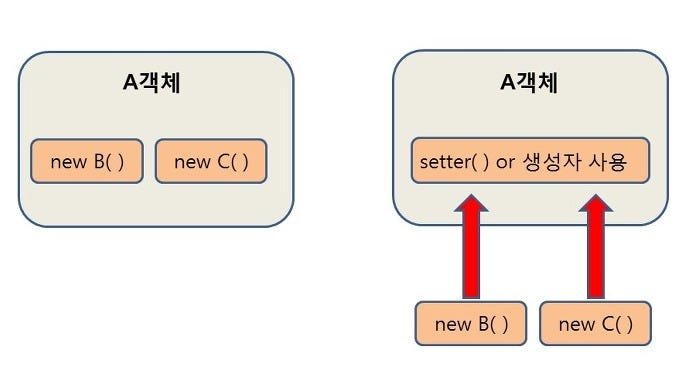

# DI, IoC, Bean, AOP

# DI란?

- Dependency Injection(의존성 주입)의 줄임말입니다.
- 말 그대로 객체와 객체간의 의존성을 주입해주는 역할입니다.
- 이를 제대로 이해하려면 우선 의존성이 무엇인지부터 이해해야합니다.

# 의존성?

객체 세상에서의 의존성💨



- 어떤 클래스가 다른 클래스를 참조하는 것을 의미
- A객체가 B,C 객체를 참조하는 일반적인 의존성 관계의 모양 <br/>
- 즉, A 클래스가 B 클래스를 사용한다면 "A 클래스는 B 클래스에 대한 의존성을 가지고 있다"라고 합니다.
- 🎶 이는 B 클래스가 변경된다면 A 클래스에 여파(사이드 이펙트)가 간다는 말 -> 이는 좋지 않다! 하나 변경 시에 계속 변경되는 것들이 있으니까!
- 하지만 객체끼리 상호작용을 해야한다면 의존성을 완전히 제거하는 방법은 없기 때문에 이를 줄이기 위한 테크닉 중 하나가 DI

# DI 사용 시

DI를 사용하면 클래스가 자신의 의존성을 직접 생성하지 않고 외부(생성자, 세터 메서드, 또는 인터페이스를 통해)에서 주입받게 됩니다.

EX. 사람이 자동차를 운전하는 상황을 고려해보자!

```
interface Car {
    void drive();
}

class Sedan implements Car {
    public void drive() {
        System.out.println("Driving a sedan.");
    }
}

class SUV implements Car {
    public void drive() {
        System.out.println("Driving an SUV.");
    }
}

class Driver {
    private Car car;

    // 생성자를 통한 의존성 주입
    public Driver(Car car) {
        this.car = car;
    }

    public void driveCar() {
        car.drive();
    }
}

public class Main {
    public static void main(String[] args) {
        Car sedan = new Sedan();
        Driver driver = new Driver(sedan);
        driver.driveCar();

        Car suv = new SUV();
        driver = new Driver(suv);
        driver.driveCar();
    }
}
```

Driver 클래스는 특정 Car 인터페이스 구현체에 의존하지 않습니다. 대신 Driver 클래스는 생성자를 통해 어떤 종류의 차 (Sedan이든, SUV이든)를 주입받아 운전합니다. <br/>
Main 클래스에서는 Driver에게 Sedan 또는 SUV 객체를 주입하여 다양한 차를 운전할 수 있도록 합니다.

# IoC란?

- IoC는 Inversion of Control(제어의 역전)의 줄임말입니다.
- 소프트웨어 설계 원칙 중 하나로 객체의 생명 주기 전반을 개발자에서 애플리케이션 혹은 프레임워크에 위임하는 겁니다.
- 전객체 생성과 의존성 주입 등 객체 관리의 전반을 자동화하는 것이라고 이해하면 편하다.

> 🚨 DI는 사용 순간부터 IoC하게 될 것을 염두에 두고 씁니다.
> IoC 원칙을 실현하기 위해서 사용하는 디자인 패턴 중 하나가 DI이기 때문입니다.

# Bean? 🫘

- 스프링에 등록되어 관리 당할 녀석들은 다 Bean.
- 즉 스프링(Spring) 컨테이너가 관리하는 자바 객체를 빈(Bean)이라 한다.

# 정리

DI + IoC + Bean

- DI: 객체를 훨씬 유연하고 유지보수성 있게 하는 매직. IoC와 매우 밀접함
- IoC: 제어의 역전. 객체의 생명주기를 프로그램이 관리하는 것. 스프링이 알아서 관리하는 거라고 생각해도 좋다.
- Bean: 스프링이 직접 관리하는 객체들. 이것들을 잘 생성해서 DI가 필요한 곳에 알아서 해준다.

# AOP

- AOP는 Aspect Oriented Programming(관점 지향 프로그래밍)의 줄임말
- 객체 지향 프로그래밍(OOP)의 부족한 부분을 보완한다.
- 어떤 로직을 기준으로 핵심적인 관점(개발자가 적용하고자 하는 핵심 비즈니스 로직), 부가적인 관점으로 나눠보고 그 관점을 기준으로 각각 모듈화 하겠다는 의미.
