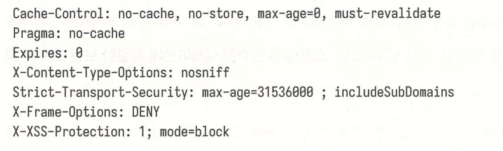

# 스프링 시큐리티 소개

- 스프링 프레임워크에는 스프링 에플리케이션의 보안에 초점을 맞춘 스프링 시큐리티 모듈이 있다.
- 스프링 부트는 spring-boot-starter-security의존 관계를 추가해서 손쉽게 스프링 시큐리티를 적용할 수 있다.

## 스프링 시큐리티가 제공해주는 기본적인 보안 기능

- 애플리케이션 사용자 인증
- 별도의 로그인 페이지가 없을 때 사용할 수 있는 기본적인 로그인 페이지
- 폼기반 로그인에 사용할 수 있는 기본 계정
- 패스워드 암호화에 사용할 수 있는 여러 가지 인코더
- 사용자 인증 성공 후 세션ID를 교체해서 세션 고정 공격 방지
- HTTP 응답 코드에 랜점 문자열 토큰을 포함해서 사이트 간 요청 위조
- 예제 5.1과 같이 공통적으로 자주 발생하는 보안 공격을 방어할 수 있는 여러 가지 HTTP응답 헤더 제공
  예제 5.1 스프링 시큐리티 기본 HTTP 응답 헤더
  
